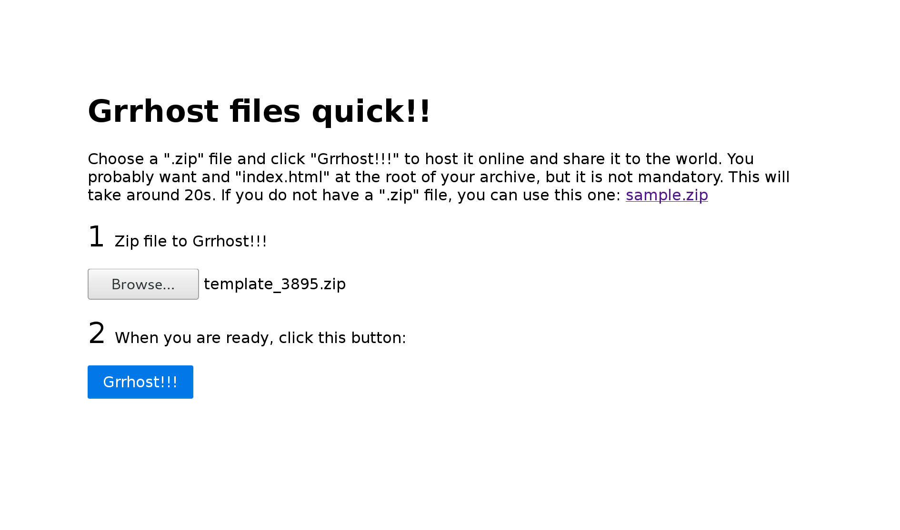

[](https://grrhosting.herokuapp.com/)
[](https://grrhosting2.herokuapp.com/)

## Grrhost your files online now!!

### What is it?

Grrhost!! is a free hosting service based on git and github pages. It lets users host files on github pages without even having to login.

### How does it work?

Install Grrhost!! on your server or use the [online demo here](https://grrhosting.herokuapp.com/) (may be down sometimes).


Select a `.zip` file and click "Grrhost!!!". Your files will be extracted and available online for you to share it to the world.

[](https://grrhosting.herokuapp.com/)

You may want to have an `index.html` file at the root of your archive to serve a website, but it is not mandatory and Grrhost will host any file.

The upload and grrhosting process will take around 20s.

After a few seconds it will redirect you to an URL where your unzipped files are accessible online.

If you do not have a ".zip" file, you can use this one: [sample.zip](./public/sample.zip)


## Host your own Grrhost!!

Clone this repository, and then:

```
$ npm i
$ PORT=3000 GRR_USER="lexoyo" GRR_PASSWORD="857241a5c5c3590ffc6b218dd65596d6d65f" npm start
```

[Password can be generated here](https://github.com/settings/tokens)
